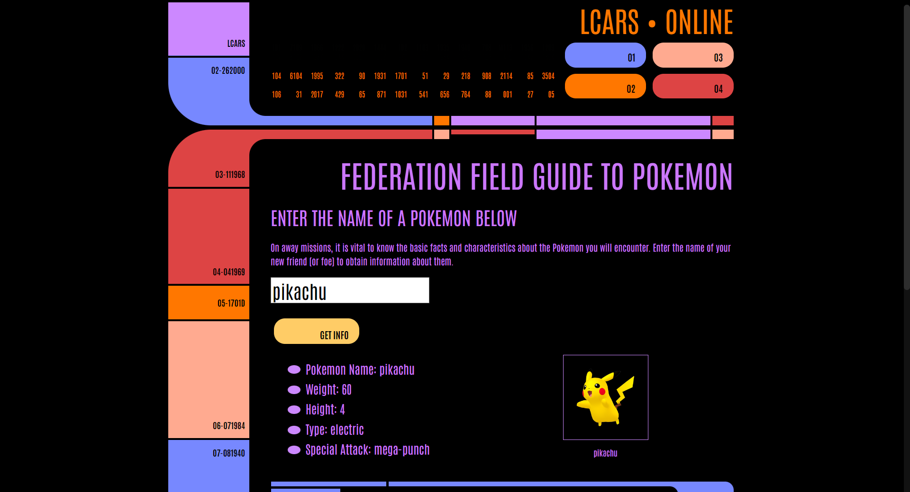

## LCARS Pokedex

A Pokedex that draws from a pokemon API using the Star Trek LCARS template. Enter the name of a Pokemon in the search box and return Pokemon Information 

**Link to project:** https://pokemon-lcars.netlify.app/

**Link to API** https://pokeapi.co/

## How It's Made:

**Tech used:** HTML, CSS, JavaScript, LCARS Site Template 

The site is built with HTML, CSS, JavaScript. The Pokemon API used is linked [here](https://pokeapi.co/) and the great LCARS template is linked [here](https://www.thelcars.com/). The LCARS template is based on the Star Trek computer system.

## Lessons Learned:

Great learning experince drawing the data from the API. Lots of trial and error to get the image to show when the pokemon is inputed.

